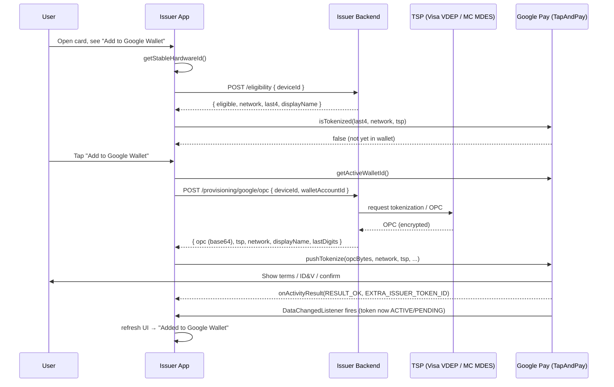

# Android Push Provisioning Demo — "Add to Google Wallet"

A production-quality reference implementation of **Google Pay push provisioning**:
adding a payment card to **Google Wallet / Google Pay** directly from an issuer's
own Android app, using Google's **`TapAndPay`** client API.

> This is a portfolio / interview deliverable. The Kotlin is real and idiomatic and
> targets the actual TapAndPay API surface. However, TapAndPay is an **allowlisted**
> API — see [Prerequisites](#prerequisites). Until your app is approved by Google,
> every TapAndPay call returns an error. That constraint is Google's, not the code's.

---

## What is push provisioning?

**Push provisioning** lets a bank/issuer app add a card to a mobile wallet with one
tap, *from inside the issuer app*, instead of the user manually typing a card number
into Google Wallet ("pull" / manual provisioning). The user is already authenticated
in their banking app, so it's faster and far less error-prone.

### The actors

| Actor | Role |
|---|---|
| **Issuer app** (this demo) | Triggers the flow, talks to the issuer backend, calls `TapAndPay.pushTokenize`. Never sees the clear PAN. |
| **Issuer backend** | The bank's server. Confirms card eligibility, and — via the TSP — produces the encrypted **OPC**. |
| **Google Pay / TapAndPay** | On-device API + UI. Runs the provisioning flow, shows T&Cs / ID&V, creates the token in Google Wallet. |
| **Card network** | **Visa (VDEP)** or **Mastercard (MDES)**. Defines the tokenization program the card participates in. |
| **Token Service Provider (TSP)** | Mints the **network token** and the **OPC**. For Visa it's Visa's VTS/VDEP; for Mastercard it's MDES. |

The **PAN** (real card number) is never handled by the app. The card network / TSP
replace it with a device-bound **token** (a DPAN), which is what actually gets stored
in Google Wallet and used at the point of sale.

---

## Prerequisites (READ THIS)

`TapAndPay` is **not** a public, self-serve API. To make these calls succeed you need:

1. **Google Wallet API / Push Provisioning access.** Request access through Google
   (Google Pay & Wallet Console / your Google Pay partner engineering contact). You
   must be — or partner with — an **approved card issuer**.
2. **App allowlisting.** Register your app's **package name** and its **signing
   certificate SHA-256 fingerprint** with Google. TapAndPay checks the calling app
   against this allowlist. An un-allowlisted app gets `ApiException` with a
   `TAP_AND_PAY_*` status (e.g. attestation / unavailable) on *every* call —
   including `getStableHardwareId`.
3. **Network enablement.** The card program must be enabled with the relevant TSP
   (Visa VDEP / Mastercard MDES) and mapped to your backend's OPC-generation service.
4. **Google Pay available on the device**, with an active Google Wallet account.

Because of (1)–(3), you cannot fully run this end-to-end without being an onboarded
issuer. The code is written to be correct the moment those approvals are in place.

---

## The OPC (Opaque Payment Card)

The **OPC** is an **encrypted blob** produced by the **TSP / issuer** that encodes
everything Google needs to create the token — but which the app cannot read. The app
receives it as base64 from its backend, decodes it to bytes, and passes it straight
to `PushTokenizeRequest.Builder().setOpaquePaymentCard(bytes)`.

Key property: **the app never touches the clear PAN.** It only shuttles an opaque,
encrypted payload from the backend to Google. This keeps the app out of PCI scope for
the card number and is the whole point of the design.

---

## End-to-end sequence

1. **Check eligibility + isTokenized.** Ask the issuer backend whether this card can
   be pushed to Google on this device, and ask Google (`isTokenized`) whether it's
   already there — so we can hide/disable the button and avoid duplicates.
2. **Resolve device ids.** `getStableHardwareId()` and `getActiveWalletId()` scope the
   OPC to this exact device + wallet.
3. **Request the OPC** from the issuer backend (which calls the TSP).
4. **`pushTokenize(...)`** with the decoded OPC bytes + network/TSP constants. Google
   Pay takes over the UI (terms, optional identity verification, confirmation).
5. **Handle the Activity result** in `onActivityResult` → `Success` / `Cancelled` /
   `Failed`.
6. **Token lifecycle.** Register a `DataChangedListener`; when tokens change on the
   device, re-query state and refresh the UI. Token states are exposed via
   `TapAndPay.TOKEN_STATE_*`.



---

## Module map

```
android/
├── settings.gradle.kts                includes :app and :pushprovisioning
├── build.gradle.kts                   AGP 8.5.2 + Kotlin 2.0.21 (apply false)
│
├── pushprovisioning/                  reusable library (the interesting part)
│   ├── build.gradle.kts               play-services-tapandpay, Retrofit/Moshi, Compose
│   └── src/main/java/com/sonholab/pushprovisioning/
│       ├── Models.kt                  Moshi models for the issuer contract + ProvisioningResult
│       ├── IssuerApiClient.kt         Retrofit service + factory (bearer auth, logging)
│       ├── PushProvisioningManager.kt TapAndPay wrapper (ids, isTokenized, pushTokenize, results, lifecycle)
│       └── AddToGoogleWalletButton.kt Compose "Add to Google Wallet" button
│
└── app/                               demo issuer app
    ├── build.gradle.kts               depends on :pushprovisioning
    └── src/main/
        ├── AndroidManifest.xml
        └── java/com/sonholab/walletdemo/MainActivity.kt   orchestrates the full flow
```

| File | Responsibility |
|---|---|
| `Models.kt` | `EligibilityRequest/Response`, `GoogleProvisioningRequest`, `GoogleOpcResponse`, sealed `ProvisioningResult`. |
| `IssuerApiClient.kt` | `checkEligibility()` + `requestGoogleOpc()` over Retrofit; bearer token via OkHttp interceptor. |
| `PushProvisioningManager.kt` | Everything TapAndPay: `getStableHardwareId`, `getActiveWalletId`, `isCardTokenized`, `pushTokenize`, `handleActivityResult`, `register/unregisterDataChangedListener`, and the string→int constant mapping. |
| `AddToGoogleWalletButton.kt` | The Compose button with an `enabled` state. |
| `MainActivity.kt` | Wires it together: checks state on start, requests the OPC on tap, handles the result. |

---

## Real vs. mocked in this demo

| Piece | Status |
|---|---|
| TapAndPay API calls (`getStableHardwareId`, `activeWalletId`, `isTokenized`, `pushTokenize`, `DataChangedListener`) | **Real API**, real symbols. Will only *succeed* once the app is allowlisted (see Prerequisites). |
| `PushTokenizeRequest` / `IsTokenizedRequest` builders, `EXTRA_ISSUER_TOKEN_ID`, `CARD_NETWORK_*`, `TOKEN_PROVIDER_*`, `RESULT_FAILED` | **Real** TapAndPay symbols from `play-services-tapandpay:18.3.3`. |
| Issuer backend (`/eligibility`, `/provisioning/google/opc`) | **Mocked** — you run a small local server implementing the contract below. |
| The **OPC** value | **Mocked** base64 in the demo backend. A real OPC comes from the TSP and is bound to the device; a fake blob will make `pushTokenize` fail at Google's side even when allowlisted. |
| The card (`card_demo_visa_4242`, "SonhoLab Debit", 4242) | **Fake** demo data. |
| The "Add to Google Wallet" glyph | **Placeholder** Canvas drawing. Ship Google's **official** button asset in production (brand-guideline requirement). |

### Wiring the base URL

The default is `http://10.0.2.2:8787` — on the **Android emulator**, `10.0.2.2` is a
special alias for the **host machine's `localhost`**, so it reaches an issuer server
running on your dev laptop at `localhost:8787`.

- **Emulator:** leave the default.
- **Physical device:** `10.0.2.2` doesn't exist. Point it at your machine's LAN IP or
  a tunnel:
  ```kotlin
  val api = IssuerApiClient.create(baseUrl = "http://192.168.1.50:8787/")
  ```
  (and prefer HTTPS off-emulator).

The bearer token defaults to `demo-session-token`; override via
`IssuerApiClient.create(sessionToken = "…")`.

---

## Issuer API contract

Base URL `http://10.0.2.2:8787` · `Authorization: Bearer demo-session-token` ·
`Content-Type: application/json`

**`POST /v1/cards/{cardId}/eligibility`**
```json
// request
{ "walletPlatform": "google", "deviceId": "<stableHardwareId>" }
// response 200
{ "eligible": true, "network": "visa", "cardholderName": "Leandro Perez",
  "last4": "4242", "displayName": "SonhoLab Debit", "reason": null }
```

**`POST /v1/provisioning/google/opc`**
```json
// request
{ "cardId": "card_demo_visa_4242", "deviceId": "<stableHardwareId>",
  "walletAccountId": "<activeWalletId>" }
// response 200
{ "opc": "<base64 Opaque Payment Card>", "tokenServiceProvider": "TOKEN_PROVIDER_VISA",
  "displayName": "SonhoLab Debit", "lastDigits": "4242", "network": "NETWORK_VISA",
  "reference": "prov_xxx" }
```

The app base64-decodes `opc` to a `ByteArray` for `setOpaquePaymentCard`.

---

## Build

```bash
# from android/
./gradlew :app:assembleDebug
```

Requires JDK 17, Android SDK 34. Run on an emulator (API 24+) with the demo issuer
backend listening on host `:8787`.
