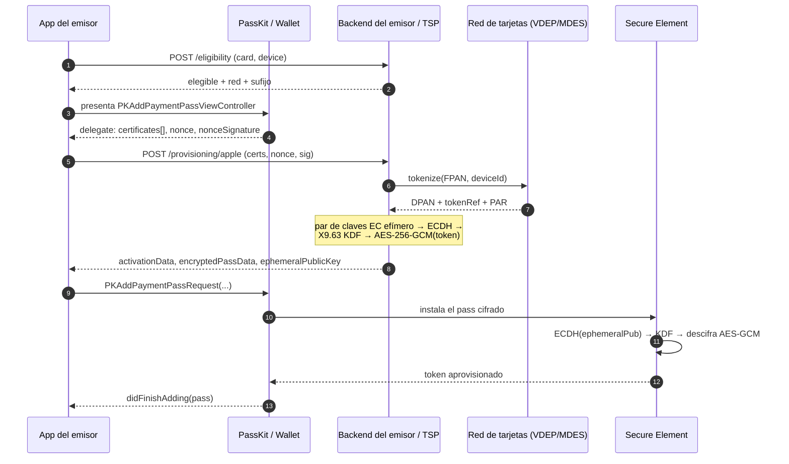
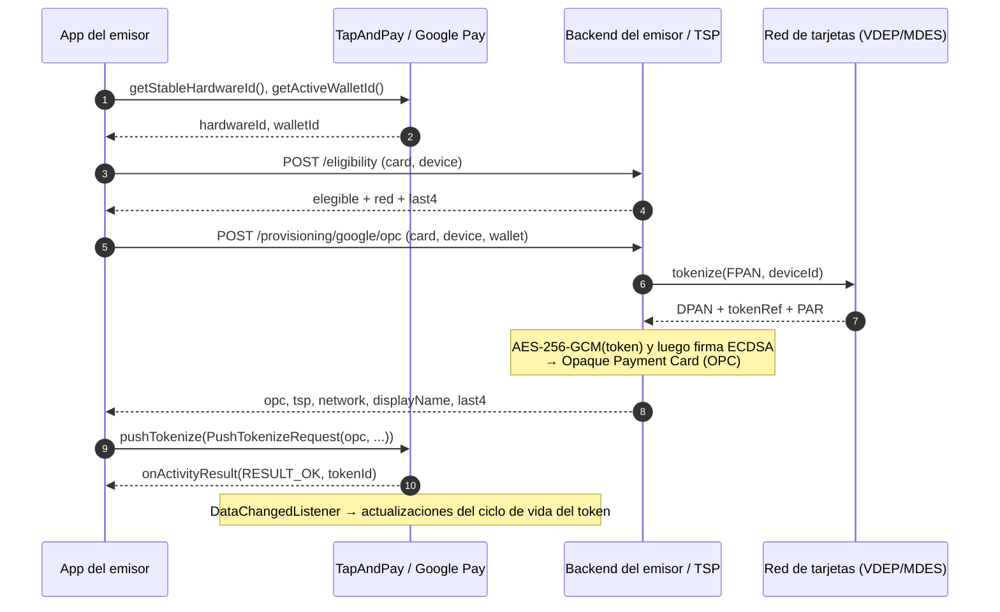
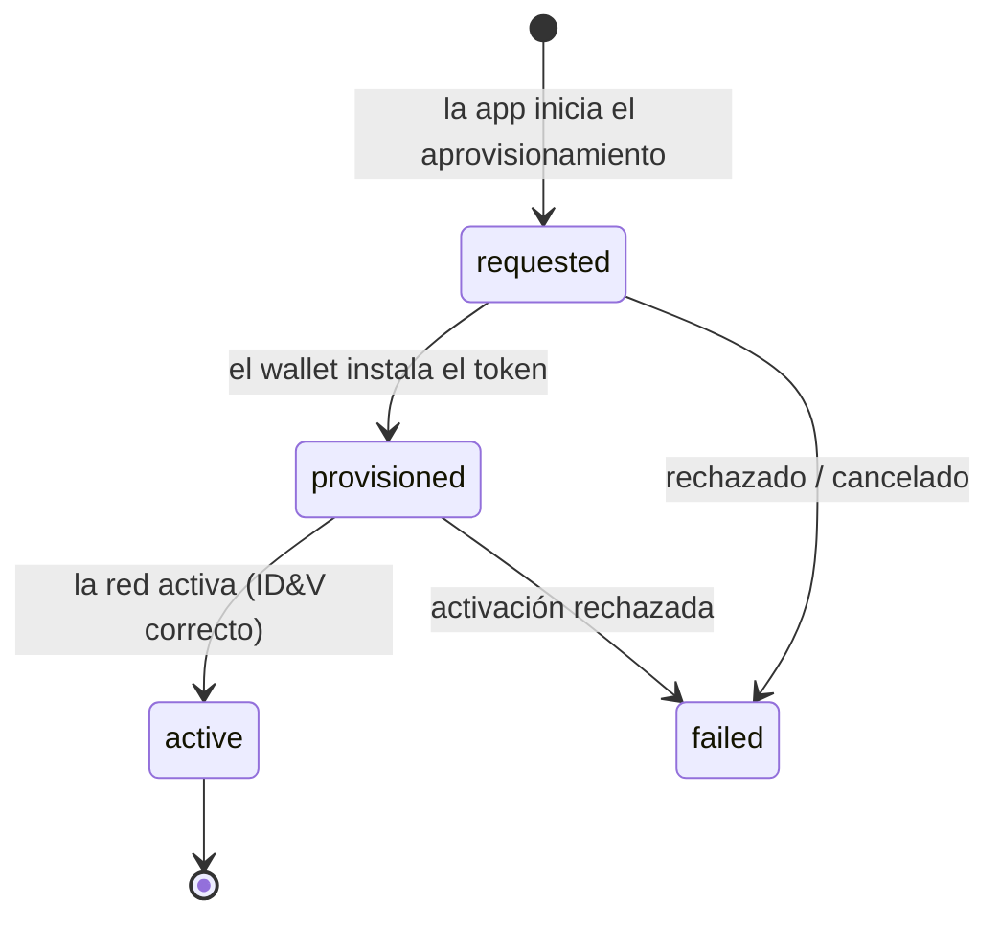

[English](sequence-diagrams.md) · **Español** · [Português](sequence-diagrams.pt.md)

# Diagramas de secuencia

Ambos wallets siguen la misma forma: **la app nunca ve el PAN en claro**; solo transporta
una carga *cifrada y tokenizada por la red* desde el emisor hacia el wallet del sistema operativo. La diferencia
está en el sobre de cifrado y en el punto de entrada del sistema operativo.

## Apple Wallet — PassKit In-App Provisioning (`ECC_V2`)

## Google Pay — TapAndPay push provisioning (`OPC`)

## Ciclo de vida (ambas plataformas)

El emisor lo rastrea con el libro mayor de aprovisionamiento (`GET /v1/provisioning/:reference/status`)
y lo hace avanzar a partir del webhook de estado del token de la red (`POST /v1/webhooks/network`).
