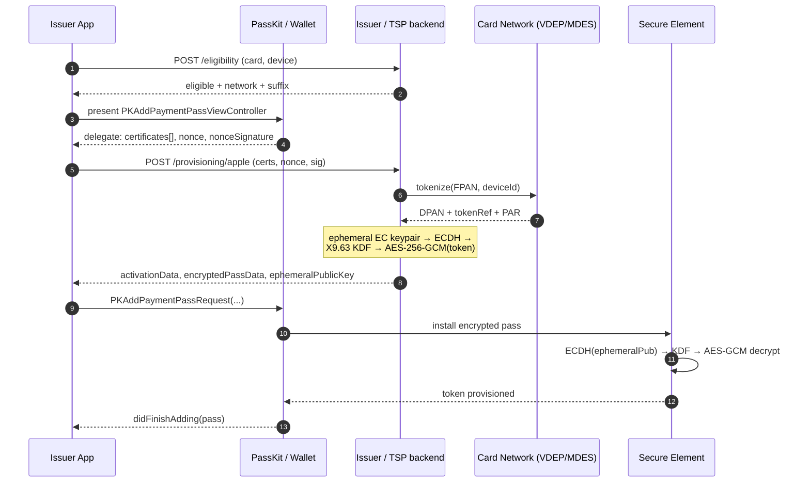
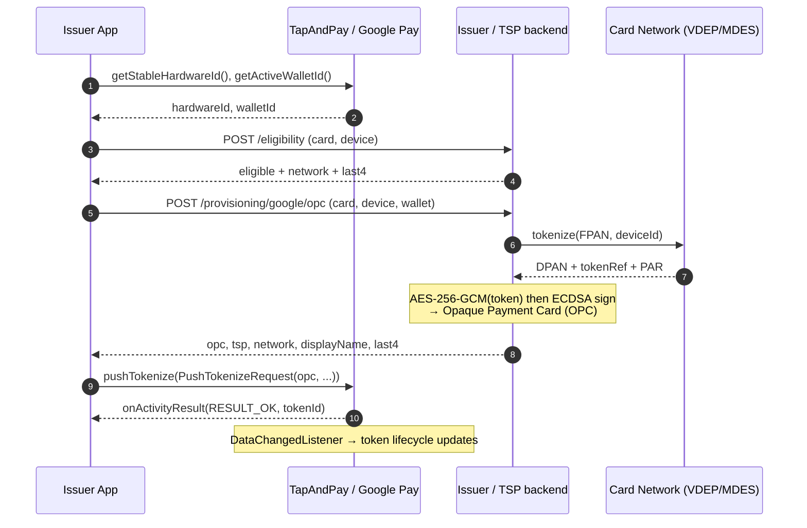
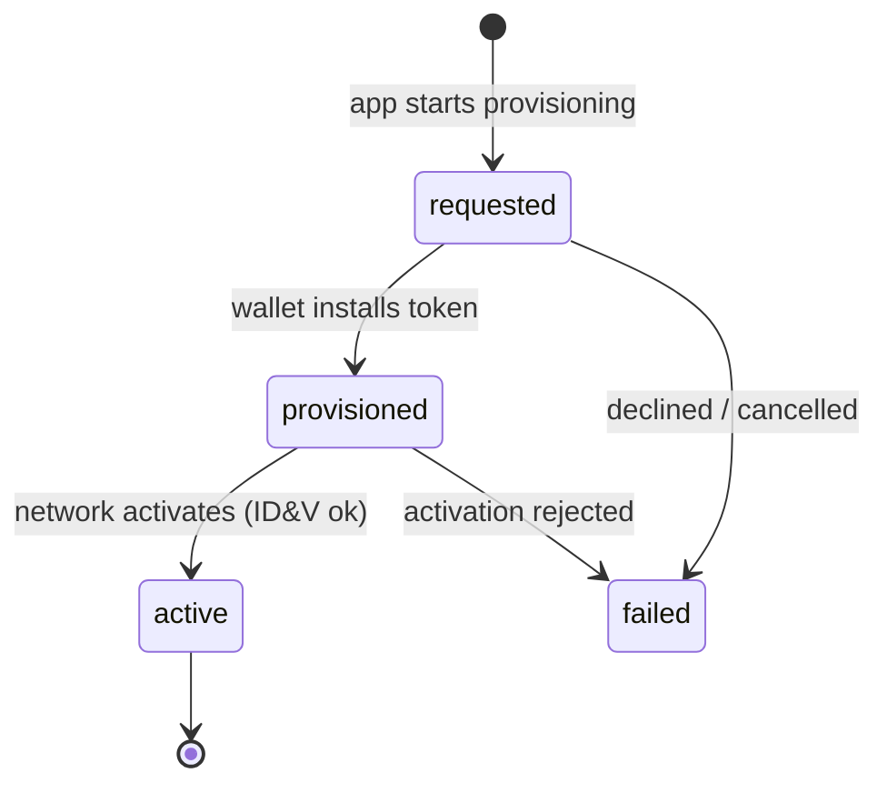

# Sequence diagrams

Both wallets follow the same shape — **the app never sees the clear PAN**; it only shuttles
an *encrypted, network-tokenized* payload from the issuer to the OS wallet. The difference
is the encryption envelope and the OS entry point.

## Apple Wallet — PassKit In-App Provisioning (`ECC_V2`)

## Google Pay — TapAndPay push provisioning (`OPC`)

## Lifecycle (both platforms)

The issuer tracks this with the provisioning ledger (`GET /v1/provisioning/:reference/status`)
and advances it from the network's token-status webhook (`POST /v1/webhooks/network`).
