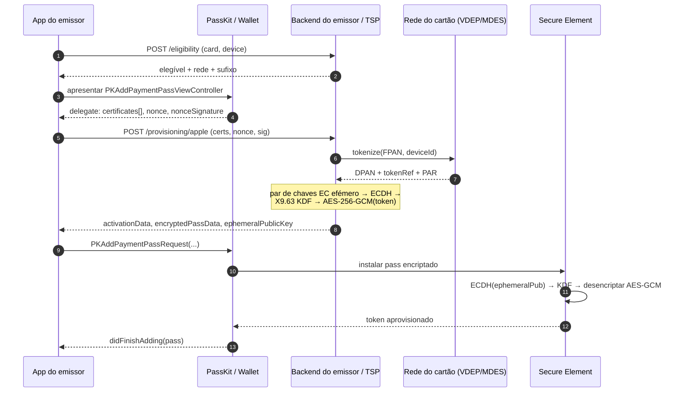
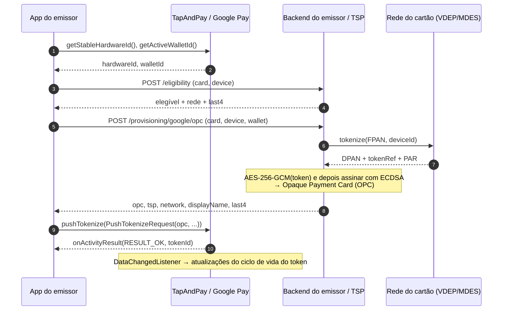
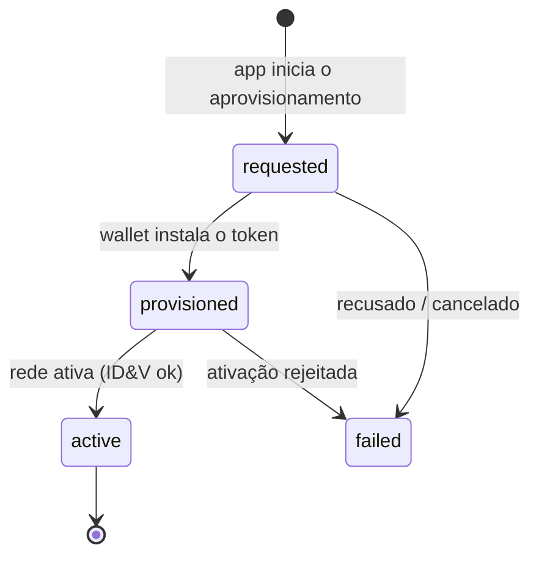

[English](sequence-diagrams.md) · [Español](sequence-diagrams.es.md) · **Português**

# Diagramas de sequência

Ambas as wallets seguem a mesma estrutura — **a app nunca vê o PAN em claro**; limita-se a transportar
um payload *encriptado e tokenizado na rede* desde o emissor até à wallet do SO. A diferença
está no envelope de encriptação e no ponto de entrada do SO.

## Apple Wallet — PassKit In-App Provisioning (`ECC_V2`)

## Google Pay — TapAndPay push provisioning (`OPC`)

## Ciclo de vida (ambas as plataformas)

O emissor acompanha este processo com o ledger de aprovisionamento (`GET /v1/provisioning/:reference/status`)
e fá-lo avançar a partir do webhook de estado do token da rede (`POST /v1/webhooks/network`).
