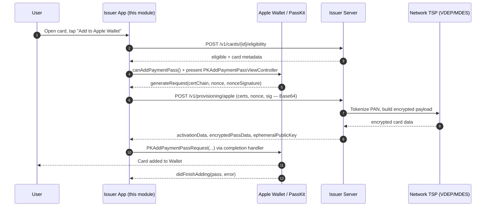

# PushProvisioning (iOS) — Apple Wallet In-App Provisioning demo

The iOS side of a **push provisioning** demo: adding a payment card to **Apple
Wallet** directly from an issuer's app, so the user never re-types the card
number. This module wraps Apple's PassKit *In-App Provisioning* API and talks to
a small issuer backend over a documented JSON contract.

> This is a portfolio / interview deliverable. The Swift is real and correct
> against Apple's public PassKit API. The parts that **cannot** run without
> Apple's grant (the entitlement, network enablement, a real device) are called
> out honestly in [What's real vs mocked](#whats-real-vs-mocked-in-this-demo).

---

## What is Apple In-App Provisioning ("push provisioning")?

"Push provisioning" is the issuer-initiated path to add a card to a wallet from
*inside the bank's app* (as opposed to "pull/manual provisioning", where the user
types the card into Wallet themselves). Apple's implementation is the
**In-App Provisioning** API in PassKit, centered on
`PKAddPaymentPassViewController`.

### The actors

| Actor | Role |
|---|---|
| **Issuer app (this module)** | Shows the "Add to Apple Wallet" button, drives PassKit, and relays wallet-provided data to the issuer server. |
| **Issuer server** | Authenticates the user, decides eligibility, and brokers the encrypted card payload with the card network's tokenization service. |
| **Apple / PassKit / Wallet** | Presents the system UI, generates a per-request certificate chain + nonce, and finally installs the pass. |
| **Card network TSP** | **Visa VDEP** or **Mastercard MDES** — the Token Service Provider that actually tokenizes the PAN and produces the encrypted, device-bound payload the issuer returns to the app. |

The app itself **never handles the real encrypted card material's keys** — it only
shuttles opaque blobs between Wallet and the issuer.

---

## Prerequisites (the honest list)

1. **The `com.apple.developer.payment-pass-provisioning` entitlement.**
   This is the gate. Apple grants it **only to approved card issuers** (or the
   developers building the issuer's app), and only after the issuer is enabled
   with the card network (VDEP / MDES). You request it through your Apple
   Developer account / Apple Pay partner engagement — it is *not* a checkbox you
   can self-enable. Without it, `PKAddPaymentPassViewController.canAddPaymentPass()`
   returns `false` and the sheet never appears. A sample entitlements file is at
   [`Sample/PushProvisioning.entitlements`](Sample/PushProvisioning.entitlements).

2. **A real device + eligible Apple ID.**
   In-App Provisioning **does not work on the iOS Simulator**. You need a physical
   device signed into an Apple ID in a supported region, with a passcode set.

3. **Wallet Extension (optional, but expected in production).**
   A production issuer app usually ships a `PKIssuerProvisioningExtension` (a
   non-UI app extension) so the card can also be offered from within the Wallet
   app itself and from the setup assistant. This demo focuses on the *in-app*
   button flow and does not include the extension, but the same
   `WalletProvisioningManager` request-building logic is what an extension's
   `PKAddPaymentPassRequest` handler would reuse.

4. **A running issuer backend** implementing the [API contract](#api-contract)
   at `http://localhost:8787` (or wherever you point `IssuerAPIClient`).

---

## The provisioning sequence

1. **Eligibility check** — the app asks the issuer whether this card can be added
   on this device (`POST /v1/cards/{cardId}/eligibility`). The response carries
   the display + routing metadata (network, cardholder name, last 4, description,
   opaque primary account identifier).
2. **Capability gate** — the app confirms `canAddPaymentPass()` and, using the
   opaque identifier, that the card isn't already provisioned.
3. **Present the controller** — build a `PKAddPaymentPassRequestConfiguration`
   (`.ECC_V2`) and present `PKAddPaymentPassViewController`.
4. **Delegate handshake** — Wallet calls back with a **certificate chain
   (leaf + sub-CA)**, a **nonce**, and a **nonce signature**. The app Base64-encodes
   these and POSTs them to the issuer (`POST /v1/provisioning/apple`).
5. **Issuer ↔ TSP** — the issuer, together with the network TSP (VDEP/MDES),
   returns `activationData`, `encryptedPassData`, and `ephemeralPublicKey`.
6. **Finish** — the app decodes those into a `PKAddPaymentPassRequest` and hands
   it back to Wallet, which installs the card and calls `didFinishAdding`.



---

## How this repo maps onto the flow

| File | Responsibility |
|---|---|
| [`Sources/PushProvisioning/Models.swift`](Sources/PushProvisioning/Models.swift) | Codable DTOs for the issuer contract (`EligibilityRequest/Response`, `AppleProvisioningRequest/Response`, `IssuerError`) + strict Base64⇄`Data` handling. |
| [`Sources/PushProvisioning/IssuerAPIClient.swift`](Sources/PushProvisioning/IssuerAPIClient.swift) | `async/await` `URLSession` client. `checkEligibility(...)` and `requestAppleProvisioning(...)`, Bearer auth, configurable base URL. |
| [`Sources/PushProvisioning/WalletProvisioningManager.swift`](Sources/PushProvisioning/WalletProvisioningManager.swift) | The core. Capability checks, builds `PKAddPaymentPassRequestConfiguration(.ECC_V2)`, presents the controller, implements `PKAddPaymentPassViewControllerDelegate` (cert/nonce → issuer → `PKAddPaymentPassRequest`), reports the result. |
| [`Sources/PushProvisioning/AddToWalletButton.swift`](Sources/PushProvisioning/AddToWalletButton.swift) | SwiftUI wrappers: `PKAddPassButton` (`UIViewRepresentable`) + a presenter for `PKAddPaymentPassViewController`. |
| [`Sample/DemoView.swift`](Sample/DemoView.swift) | SwiftUI demo screen wiring it all together (eligibility on appear, card preview, status). |
| [`Sample/PushProvisioning.entitlements`](Sample/PushProvisioning.entitlements) | Sample entitlement plist (Apple-granted key). |

### Step 4 in code

The delegate method
`addPaymentPassViewController(_:generateRequestWithCertificateChain:nonce:nonceSignature:completionHandler:)`
in `WalletProvisioningManager`:

- converts each `SecCertificate` to DER via `SecCertificateCopyData`,
- `await`s `IssuerAPIClient.requestAppleProvisioning(...)`,
- decodes the three Base64 fields into `Data`,
- sets `PKAddPaymentPassRequest.activationData`, `.encryptedPassData`,
  `.ephemeralPublicKey`,
- and calls the completion handler (with an **empty request** on failure so
  Wallet can tear down cleanly; the real error is surfaced from
  `didFinishAdding`).

---

## What's real vs mocked in this demo

**Real (correct, compilable Swift):**
- All PassKit usage: `PKAddPaymentPassViewController`, its delegate,
  `PKAddPaymentPassRequestConfiguration(encryptionScheme: .ECC_V2)`,
  `PKAddPaymentPassRequest`, `PKAddPassButton`, `PKPassLibrary`,
  `PKPaymentNetwork`.
- The capability logic (`canAddPaymentPass()` +
  `canAddPaymentPass(withPrimaryAccountIdentifier:)`).
- The issuer networking client and the full Base64⇄`Data` conversion at both
  boundaries.
- The delegate handshake wiring end-to-end.

**Mocked / out of scope:**
- The **issuer backend** is a separate demo server; it does not perform real
  VDEP/MDES tokenization — it returns well-formed Base64 placeholders shaped like
  the real payload. A real payload only decrypts inside the Secure Element.
- The **entitlement** cannot be self-granted; without Apple's approval the sheet
  won't present on a real device.
- Consequently the **happy path (card actually installed) cannot be demonstrated**
  without being an approved issuer on an entitled build + real device. Everything
  up to and including the delegate call and the issuer round-trip is exercisable.

---

## Integration steps for a real project

1. **Add the package (SPM).** In Xcode: *File ▸ Add Package Dependencies…* and
   point at this repo, or add locally:
   ```swift
   .package(path: "../push-provisioning-demo/ios")
   ```
   then add `"PushProvisioning"` to your app target's dependencies.

2. **Add the entitlement.** Set *Build Settings ▸ Code Signing Entitlements* to
   your entitlements file containing
   `com.apple.developer.payment-pass-provisioning = true`, and make sure your App
   ID is entitled by Apple. (See
   [`Sample/PushProvisioning.entitlements`](Sample/PushProvisioning.entitlements).)

3. **Point the client at your backend.**
   ```swift
   let client = IssuerAPIClient(
       baseURL: URL(string: "https://issuer.example.com")!,
       sessionToken: authenticatedUserSessionToken
   )
   ```

4. **Drive the flow** from SwiftUI:
   ```swift
   let manager = WalletProvisioningManager(cardId: "card_123", apiClient: client)

   // In your view:
   AddToWalletButton(isEnabled: manager.canAddCard(primaryAccountIdentifier: id)) {
       if let vc = manager.makeProvisioningController(eligibility: eligibility,
                                                      completion: handleResult) {
           controller = vc   // presented via .paymentPassSheet(controller:)
       }
   }
   ```

5. **Test on a real device** with an eligible Apple ID. The Simulator will report
   `canAddPaymentPass() == false` and the button stays disabled — that's expected.

---

## API contract (issuer backend)

Base URL default `http://localhost:8787`. Every request sends
`Authorization: Bearer demo-session-token` and `Content-Type: application/json`.

**`POST /v1/cards/{cardId}/eligibility`**
```json
// request
{ "walletPlatform": "apple", "deviceId": "<string>" }
// response 200
{ "eligible": true, "network": "visa",
  "cardholderName": "Leandro Perez", "primaryAccountSuffix": "4242",
  "localizedDescription": "SonhoLab Debit",
  "primaryAccountIdentifier": "<opaque or empty>", "reason": null }
```

**`POST /v1/provisioning/apple`**
```json
// request
{ "cardId": "<string>",
  "certificates": ["<base64 leaf DER>", "<base64 subCA DER>"],
  "nonce": "<base64>", "nonceSignature": "<base64>" }
// response 200
{ "activationData": "<base64>", "encryptedPassData": "<base64>",
  "ephemeralPublicKey": "<base64>", "reference": "prov_xxx" }
```

The three response fields map **directly** onto `PKAddPaymentPassRequest`
(`activationData`, `encryptedPassData`, `ephemeralPublicKey`) after Base64 → `Data`.
